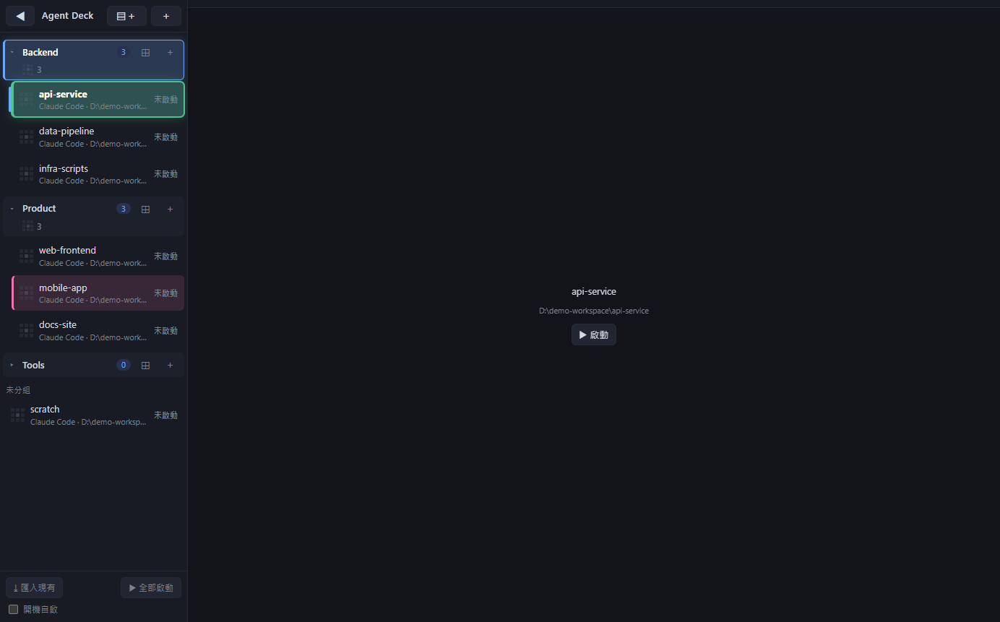
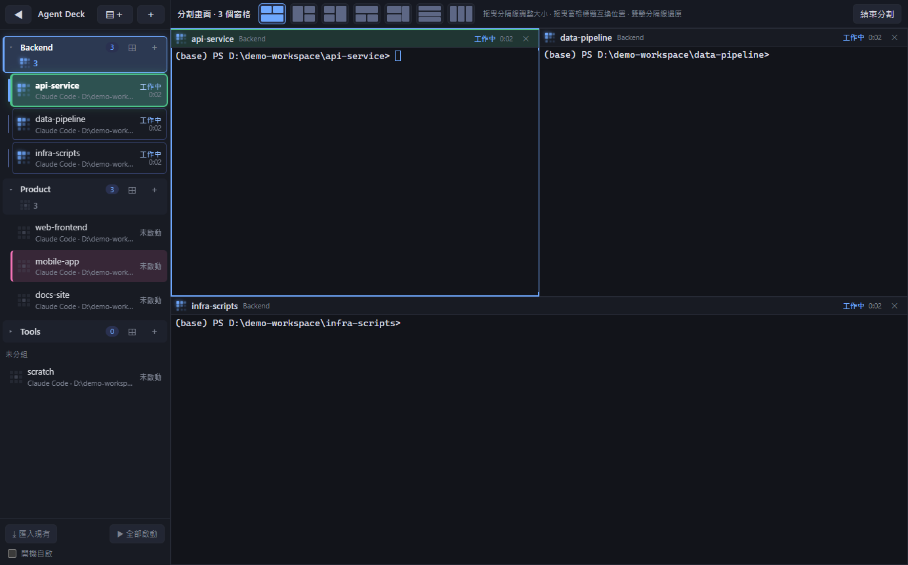
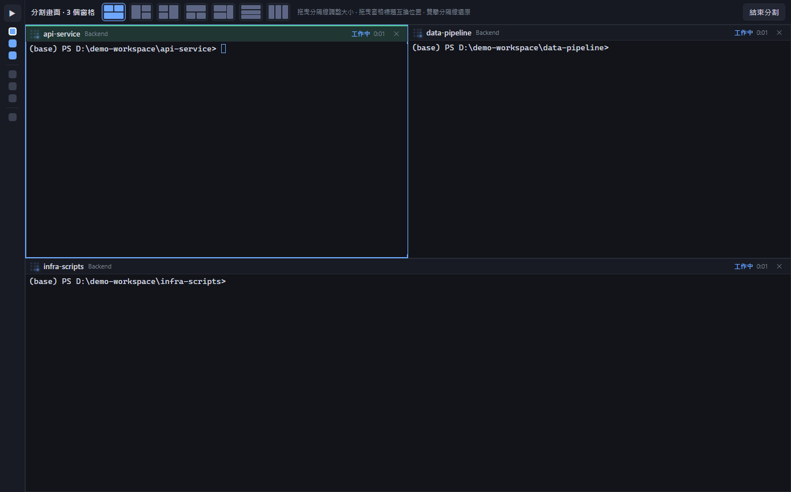

# Agent Deck

**一個視窗，管理你所有的 AI 寫程式助手。**

如果你同時開很多專案、每個專案都跑 Claude Code、Codex、OpenCode 之類的工具，你一定遇過這些事：

- 關機重開後，要一個一個進資料夾、一個一個 resume 對話。
- 同時跑幾十個 agent，有的已經做完在等你，有的卡住了，你卻沒發現。

Agent Deck 幫你解決這些問題。它是一個 Windows 桌面程式，把每個專案開成一張「卡片」，卡片列在左邊，右邊是終端機。關掉再打開，所有卡片會自動回到原本的資料夾，並接回上次的對話。



## 它能做什麼

- **一張卡片 = 一個專案 = 一個 agent 對話**，重開機後自動接回。
- **燈號告訴你狀態**：藍色波浪是工作中，綠色靜止是做完了等你，黃色十字是需要你決定，紅色 X 是出錯了。背景的卡片如果需要你，外圈會亮起來。
- **群組**：把相關的卡片放進同一個專案群組，可以收合。收合時仍看得到裡面有沒有需要你的卡片。
- **分割畫面**：一個畫面同時看多個 agent。點專案標題的 `⊞`，就會把該專案的卡片並排排好。



- **收合側欄**：不需要卡片列時可以收起來，只留下每張卡片一個色點。



## 怎麼開始

1. 安裝 [Node.js](https://nodejs.org/)，然後在這個資料夾執行：
   ```
   npm install
   npm start
   ```
   （或直接雙擊 `start.bat`）
2. 按 **＋** 新增卡片：選資料夾、選 agent（Claude Code、Codex、OpenCode…），按儲存。卡片會自動開啟並執行對應的指令。
3. 想回到之前的工作？按 **⤓ 匯入現有**，它會找出你正在跑的終端機和最近的 Claude 對話，勾選後一鍵加進來。

## 基本操作

| 想做什麼 | 怎麼做 |
|---|---|
| 新增卡片 | `＋` 或 Ctrl+T |
| 切換卡片 | 點左邊的卡片，或 Alt+1～9 |
| 改名字 | 雙擊卡片，或按 F2 |
| 換顏色 | 右鍵卡片 → 顏色 |
| 建立專案群組 | 側欄頂端 `▤＋` |
| 分割畫面 | 點專案標題的 `⊞`；Ctrl+點卡片可加入或移出分割 |
| 收合側欄 | ◀ 或 Ctrl+B |
| 放大或縮小字體 | Ctrl+滾輪，Ctrl+0 還原 |
| 關閉卡片 | Ctrl+W（不會刪除資料夾） |

## 支援的 agent

Claude Code、Codex、OpenCode、Gemini CLI、agy，以及任何能在終端機執行的工具（選「自訂」填入指令即可）。

## 🧭 中控 Agent：讓 agent 之間互相溝通（跨平台）

按側欄下方的 **🧭 中控**，會開一張 Claude Code 卡片當「中控」。它能看到每張卡片在做什麼，也能把訊息送給任何一張卡片裡的 agent，不論那張是 Claude Code、Codex 還是 OpenCode。卡片裡的 agent 也能回覆中控或傳給彼此。

中控可以用的工具（agentdeck MCP）：

| 工具 | 做什麼 |
|---|---|
| `list_agents` | 列出所有卡片：名稱、平台、專案、目前狀態 |
| `read_agent` | 讀某張卡片最新的畫面 |
| `send_to_agent` | 傳訊息給某張卡片（預設等它「待輸入」才送，不會打斷它正在做的事） |
| `wait_for_agent` | 等某張卡片做完，取回它的畫面 |
| `message_status` | 查訊息送達了沒 |

你可以直接跟中控說：「看一下大家的狀態」、「請 backend 跑完測試後回報給我」、「叫 docs 依照 backend 的 API 更新文件」。

中控也能聯絡 **Agent Deck 以外**你另外開的 Claude Code session（`list_agents` 會標示「outside Agent Deck」）。

**訊息怎麼送達**

| 目標 | 通道 |
|---|---|
| Claude Code（卡片內或外部 session） | **Claude Code 原生的跨 session 收件匣**（見下方說明），由 Claude 自己決定直接收下或先保留等你核准 |
| Codex、OpenCode、agy 等 | 等該卡片「待輸入」時，把訊息貼進它的終端並送出 |

**各平台怎麼接上 agentdeck 工具**（Agent Deck 自動處理，不會改你自己的設定檔）：

| 平台 | 方式 | 實測 |
|---|---|---|
| Claude Code | 啟動指令自動加上 `--mcp-config` | 收、發、雙向回覆 ✔（原生收件匣；一般權限模式下會先問你才用工具） |
| Codex | 啟動指令自動加上 `-c mcp_servers.agentdeck.*`（透過 `.cmd` 啟動檔，避開 PowerShell 5.1 的引號問題） | 收、發 ✔ |
| OpenCode | 卡片終端自動帶 `OPENCODE_CONFIG_CONTENT`，會和你原本的 MCP 設定合併 | 收、發 ✔ |
| agy | 只能全域設定，需要自己執行一次：`agy mcp add agentdeck "%APPDATA%\agent-deck\central\agentdeck-mcp.cmd"`（移除：`agy mcp remove agentdeck`） | 收、發、雙向回覆 ✔ |

**Claude Code 原生收件匣（逆向後遷移）**

Claude Code 的跨 session 訊息是這樣運作的（從 CLI 逆向，再用真正的 Claude Code 客戶端兩個方向都實測確認）：

| 部分 | 內容 |
|---|---|
| 註冊 | 每個 session 寫 `~/.claude/sessions/<pid>.json`：名稱、資料夾、狀態、`procStart`（程序真實啟動時間）、`peerFeatures`、收件匣位址 |
| 金鑰 | `~/.claude/sessions/<pid>.<小寫收件匣路徑的 SHA-256>.key` 裡的 `peerToken` |
| 收件匣 | 本機 named pipe（`\\.\pipe\LOCAL\cc-msg-…`），每行一個 JSON，第一行必須是驗證行 |
| 訊息 | `type:"user"`，帶 `msg_id`、`priority`、寄件人收件匣 `from`；內容包在 `<cross-session-message from=… from-name=…>` 裡 |
| 控制 | `notify_when_idle`（閒置時通知我）、`peer_idle_notice`（閒置通知）、`peer_message_status`（送達回執：held / delivered / denied …） |

Agent Deck 在這個網路上是一個**誠實的 peer**（`src/main/ccmsg.js`、`src/main/ccpeer.js`）：
- **寄件**：送進 Claude 卡片或外部 Claude session 的收件匣（用程序樹判斷哪個 session 屬於哪張卡片）。
- **收件**：Agent Deck 以 `agent-deck` 的名稱註冊（自己的 PID 與真實啟動時間，結束時移除；被強制關閉留下的殘骸，下次啟動會清掉）。任何 Claude session 都能用內建的 `SendMessage` 傳給 `agent-deck`，Agent Deck 會轉給當初寫信給它的卡片，沒有的話就轉給中控。
- **回執**：Claude 回傳的送達狀態會寫回訊息，`message_status` 看得到「已保留等你核准」等真實狀態。

Claude Code 對收到的訊息有自己的保護，Agent Deck 完全照它的規則走，**不偽造身分、不假宣告權限模式**：
- 一般權限模式的 session：訊息直接進入它的輸入佇列。
- 「略過權限確認」模式的 session：訊息會被**保留**，畫面出現審閱框（預設選項是 Deny），由你決定送不送。卡片燈號會顯示「需決策」。想讓它直接收下，可以在 Claude Code 設定把 `crossSessionInbound` 設成 `accept`（這是你自己的選擇，Agent Deck 不會替你改）。
- 找不到某張 Claude 卡片的收件匣時，訊息會回報失敗，**不會**改用貼上（那等於繞過上述保護）。若你確定要用貼上，可在工作區設定把 `settings.claudeLane` 設為 `"paste"`。

**安全設計**
- 訊息只在本機傳遞（127.0.0.1，每次啟動產生新的隨機 token）。
- 只有中控卡片預先允許使用這些工具；一般卡片要傳訊息前，會照該 agent 的權限設定先問你。
- 貼上通道只會送進「待輸入」的卡片，不會貼進正在問你問題的畫面（權限確認、信任此資料夾、Claude 的審閱框等）。
- 每則訊息都標明寄件人；同一串對話最多來回 4 次，避免 agent 之間無限互傳。
- 收到的訊息是「另一個 agent 寫的」，請像看待任何外部輸入一樣看待它。

## 系統需求

目前只在 **Windows 10／11** 測試過，macOS 還沒有支援。

## 給開發者

```
src/main/        主程序（終端機、存檔、session 掃描）
src/renderer/    畫面
test/            單元測試：node test/<name>.test.js
scripts/         開發用腳本（產生圖示）
```

## 授權

[PolyForm Noncommercial 1.0.0](./LICENSE)：**可以免費用、學習、修改、分享，但禁止商業用途。** 需要商業授權請開 issue 聯絡作者。
